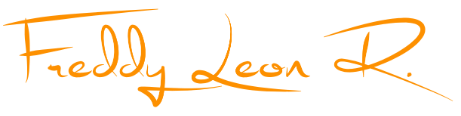

  <h1>⚡ LEONUKEG — SYSTEMS ONLINE.</h1>
  
<b>Full-Stack Developer · Python & Reflex · Building interfaces that don't apologize.</b>

  
<i>"Maximizing development velocity without sacrificing structural integrity."</i>

   

  

---

### 📡 SYSTEM PROTOCOLS // ABOUT_ME

* 🔋 **Current Directive:** Building full-stack web applications entirely in **Python** with the **Reflex** framework — one stack to rule both frontend and backend.
* 🧠 **Background:** Coming from physical infrastructure (photovoltaic installations) into software. I understand systems at both the hardware and code layer.
* 🛠️ **Current Build:** Personal portfolio in Reflex + expanding my Python toolkit through the 100 Days of Code challenge.
* 🌐 **Long-term Vector:** Web3 & decentralized systems — but right now I'm sharpening the fundamentals first.
* ⚡ **Design Language:** Nocturnal. Technical. Minimalist. The UI is intentional; the logic is ruthless.

---

### 💻 TECH_STACK // ARSENAL

---

### 🚀 ACTIVE_PROJECTS // CURRENT_OPERATIONS

| Project | Stack | Status |
|---|---|---|
| [🌐 Portfolio v2](https://leonukeg.github.io/leonukeg-portfolio/) | Vanilla JS · GSAP · CSS3 | ✅ Live |
| [🐍 100 Days of Code](https://github.com/leonukeg/100_days_of_code) | Python | 🔄 In Progress |
| [⚡ Portfolio REFLEX](https://github.com/leonukeg/leonukeg_portfolio_REFLEX) | Python · Reflex | 🛠️ Building |

---

### 🌐 NETWORK // COMM_LINKS

 

### ☕ SUPPORT_THE_NODE

 

  

